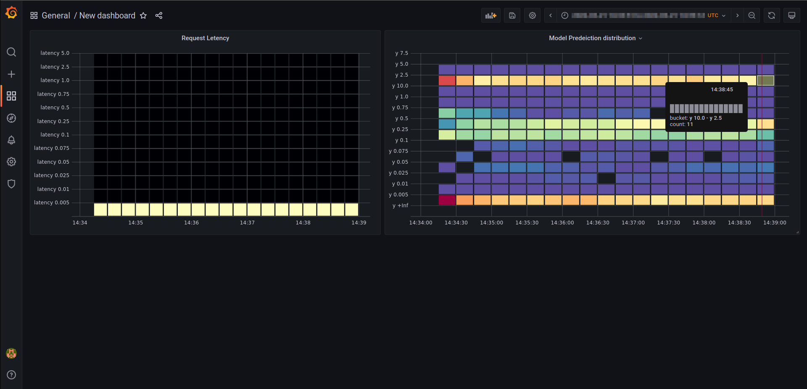

<div align="center">

<a href="https://app.community.clear.ml"></a>

**ClearML Serving - Model deployment made easy**

## **`clearml-serving v2.0` </br> :sparkles: Model Serving (ML/DL) Made Easy :tada:**


[](https://img.shields.io/github/license/allegroai/clearml-serving.svg)
[](https://img.shields.io/pypi/pyversions/clearml-serving.svg)
[](https://img.shields.io/pypi/v/clearml-serving.svg)
[](https://artifacthub.io/packages/helm/allegroai/clearml-serving)
[](https://join.slack.com/t/allegroai-trains/shared_invite/zt-c0t13pty-aVUZZW1TSSSg2vyIGVPBhg)


</div>


**`clearml-serving`** is a command line utility for model deployment and orchestration.  
It enables model deployment including serving and preprocessing code to a Kubernetes cluster or custom container based solution.

### :fire: NEW :confetti_ball: Take it for a spin with a simple `docker-compose` [command](#nail_care-initial-setup) :magic_wand: :sparkles: 


<a></a>

Features:
* Easy to deploy & configure
  * Support Machine Learning Models (Scikit Learn, XGBoost, LightGBM)
  * Support Deep Learning Models (Tensorflow, PyTorch, ONNX)
  * Customizable RestAPI for serving (i.e. allow per model pre/post-processing for easy integration)
* Flexible  
  * On-line model deployment 
  * On-line endpoint model/version deployment (i.e. no need to take the service down)
  * Per model standalone preprocessing and postprocessing python code 
* Scalable
  * Multi model per container
  * Multi models per serving service
  * Multi-service support (fully seperated multiple serving service running independently)
  * Multi cluster support
  * Out-of-the-box node auto-scaling based on load/usage
* Efficient
  * Multi-container resource utilization
  * Support for CPU & GPU nodes
  * Auto-batching for DL models
* Automatic deployment
  * Automatic model upgrades w/ canary support 
  * Programmable API for model deployment
* Canary A/B deployment
  * Online Canary updates
* Model Monitoring
  * Usage Metric reporting
  * Metric Dashboard
  * Model performance metric
  * Model performance Dashboard

## ClearML Serving Design 

### ClearML Serving Design Principles 

**Modular** , **Scalable** , **Flexible** , **Customizable** , **Open Source**

## Installation

### Prerequisites

* ClearML-Server : Model repository, Service Health, Control plane
* Kubernetes / Single-instance Machine : Deploying containers 
* CLI : Configuration & model deployment interface

### :nail_care: Initial Setup

1. Setup your [**ClearML Server**](https://github.com/allegroai/clearml-server) or use the [Free tier Hosting](https://app.clear.ml)
2. Setup local access (if you haven't already), see instructions [here](https://clear.ml/docs/latest/docs/getting_started/ds/ds_first_steps#install-clearml)
3. Install clearml-serving CLI: 
```bash
pip3 install clearml-serving
```
4. Create the Serving Service Controller
  - `clearml-serving create --name "serving example"`
  - The new serving service UID should be printed `New Serving Service created: id=aa11bb22aa11bb22`
5. Write down the Serving Service UID
6. Clone clearml-serving repository
```bash
git clone https://github.com/allegroai/clearml-serving.git
```
7. Edit the environment variables file (`docker/example.env`) with your clearml-server credentials and Serving Service UID. For example, you should have something like
```bash
cat docker/example.env
```
```bash
  CLEARML_WEB_HOST="https://app.clear.ml"
  CLEARML_API_HOST="https://api.clear.ml"
  CLEARML_FILES_HOST="https://files.clear.ml"
  CLEARML_API_ACCESS_KEY="<access_key_here>"
  CLEARML_API_SECRET_KEY="<secret_key_here>"
  CLEARML_SERVING_TASK_ID="<serving_service_id_here>"
```
8. Spin the clearml-serving containers with docker-compose (or if running on Kubernetes use the helm chart)
```bash
cd docker && docker-compose --env-file example.env -f docker-compose.yml up 
```
If you need Triton support (keras/pytorch/onnx etc.), use the triton docker-compose file
```bash
cd docker && docker-compose --env-file example.env -f docker-compose-triton.yml up 
```
:muscle: If running on a GPU instance w/ Triton support (keras/pytorch/onnx etc.), use the triton gpu docker-compose file
```bash
cd docker && docker-compose --env-file example.env -f docker-compose-triton-gpu.yml up 
```

> **Notice**: Any model that registers with "Triton" engine, will run the pre/post processing code on the Inference service container, and the model inference itself will be executed on the Triton Engine container.


### :ocean: Optional: advanced setup - S3/GS/Azure access

To add access credentials and allow the inference containers to download models from your S3/GS/Azure object-storage,
add the respective environment variables to your env files (`example.env`)
See further details on configuring the storage access [here](https://clear.ml/docs/latest/docs/integrations/storage#configuring-storage)

```bash
AWS_ACCESS_KEY_ID
AWS_SECRET_ACCESS_KEY
AWS_DEFAULT_REGION

GOOGLE_APPLICATION_CREDENTIALS

AZURE_STORAGE_ACCOUNT
AZURE_STORAGE_KEY
```

### :information_desk_person: Concepts

**CLI** - Secure configuration interface for on-line model upgrade/deployment on running Serving Services

**Serving Service Task** - Control plane object storing configuration on all the endpoints. Support multiple separated instance, deployed on multiple clusters.

**Inference Services** - Inference containers, performing model serving pre/post processing. Also support CPU model inferencing.

**Serving Engine Services** - Inference engine containers (e.g. Nvidia Triton, TorchServe etc.) used by the Inference Services for heavier model inference.

**Statistics Service** - Single instance per Serving Service  collecting and broadcasting model serving & performance statistics

**Time-series DB** - Statistics collection service used by the Statistics Service, e.g. Prometheus

**Dashboards** - Customizable dashboard-ing solution on top of the collected statistics, e.g. Grafana

### :point_right: Toy model (scikit learn) deployment example 

1. Train toy scikit-learn model
  - create new python virtual environment
  - `pip3 install -r examples/sklearn/requirements.txt`
  - `python3 examples/sklearn/train_model.py`
  - Model was automatically registered and uploaded into the model repository. For Manual model registration see [here](#turtle-registering--deploying-new-models-manually) 
2. Register the new Model on the Serving Service
  - `clearml-serving --id <service_id> model add --engine sklearn --endpoint "test_model_sklearn" --preprocess "examples/sklearn/preprocess.py" --name "train sklearn model" --project "serving examples"`
  - **Notice** the preprocessing python code is packaged and uploaded to the "Serving Service", to be used by any inference container, and downloaded in realtime when updated
3. Spin the Inference Container
  - Customize container [Dockerfile](clearml_serving/serving/Dockerfile) if needed
  - Build container `docker build --tag clearml-serving-inference:latest -f clearml_serving/serving/Dockerfile .`
  - Spin the inference container: `docker run -v ~/clearml.conf:/root/clearml.conf -p 8080:8080 -e CLEARML_SERVING_TASK_ID=<service_id> -e CLEARML_SERVING_POLL_FREQ=5 clearml-serving-inference:latest` 
4. Test new model inference endpoint
  - `curl -X POST "http://127.0.0.1:8080/serve/test_model_sklearn" -H "accept: application/json" -H "Content-Type: application/json" -d '{"x0": 1, "x1": 2}'`
  
**Notice**, now that we have an inference container running, we can add new model inference endpoints directly with the CLI. The inference container will automatically sync once every 5 minutes.

**Notice** On the first few requests the inference container needs to download the model file and preprocessing python code, this means the request might take a little longer, once everything is cached, it will return almost immediately.

**Notes:**
> Review the model repository in the ClearML web UI, under the "serving examples" Project on your ClearML account/server ([free hosted](https://app.clear.ml) or [self-deployed](https://github.com/allegroai/clearml-server)).

> Inference services status, console outputs and machine metrics are available in the ClearML UI in the Serving Service project (default: "DevOps" project)

> To learn more on training models and the ClearML model repository, see the [ClearML documentation](https://clear.ml/docs)

### :turtle: Registering & Deploying new models manually 

Uploading an existing model file into the model repository can be done via the `clearml` RestAPI, the python interface, or with the `clearml-serving` CLI. 

> To learn more on training models and the ClearML model repository, see the [ClearML documentation](https://clear.ml/docs)

- local model file on our laptop: 'examples/sklearn/sklearn-model.pkl'
- Upload the model file to the `clearml-server` file storage and register it
`clearml-serving --id <service_id> model upload --name "manual sklearn model" --project "serving examples" --framework "scikit-learn" --path examples/sklearn/sklearn-model.pkl`
- We now have a new Model in the "serving examples" project, by the name of "manual sklearn model". The CLI output prints the UID of the newly created model, we will use it to register a new endpoint 
- In the `clearml` web UI we can see the new model listed under the `Models` tab in the associated project. we can also download the model file itself directly from the web UI 
- Register a new endpoint with the new model
`clearml-serving --id <service_id> model add --engine sklearn --endpoint "test_model_sklearn" --preprocess "examples/sklearn/preprocess.py" --model-id <newly_created_model_id_here>`

**Notice** we can also provide a differnt storage destination for the model, such as S3/GS/Azure, by passing
`--destination="s3://bucket/folder"`, `gs://bucket/folder`, `azure://bucket/folder`. Yhere is no need to provide a unique path tp the destination argument, the location of the model will be a unique path based on the serving service ID and the model name


### :rabbit: Automatic model deployment

The clearml Serving Service support automatic model deployment and upgrades, directly connected with the model repository and API. When the model auto-deploy is configured, a new model versions will be automatically deployed when you "publish" or "tag" a new model in the `clearml` model repository. This automation interface allows for simpler CI/CD model deployment process, as a single API automatically deploy (or remove) a model from the Serving Service.

#### :bulb: Automatic model deployment example

1. Configure the model auto-update on the Serving Service
- `clearml-serving --id <service_id> model auto-update --engine sklearn --endpoint "test_model_sklearn_auto" --preprocess "preprocess.py" --name "train sklearn model" --project "serving examples" --max-versions 2`
2. Deploy the Inference container (if not already deployed)
3. Publish a new model the model repository
- Go to the "serving examples" project in the ClearML web UI, click on the Models Tab, search for "train sklearn model" right click and select "Publish"
- Use the RestAPI [details](https://clear.ml/docs/latest/docs/references/api/models#post-modelspublish_many)
- Use Python interface: 
```python
from clearml import Model
Model(model_id="unique_model_id_here").publish()
```
4. The new model is available on a new endpoint version (1), test with: 
`curl -X POST "http://127.0.0.1:8080/serve/test_model_sklearn_auto/1" -H "accept: application/json" -H "Content-Type: application/json" -d '{"x0": 1, "x1": 2}'`

### :bird: Canary endpoint setup

Canary endpoint deployment add a new endpoint where the actual request is sent to a preconfigured set of endpoints with pre-provided distribution. For example, let's create a new endpoint "test_model_sklearn_canary", we can provide a list of endpoints and probabilities (weights).

```bash
clearml-serving --id <service_id> model canary --endpoint "test_model_sklearn_canary" --weights 0.1 0.9 --input-endpoints test_model_sklearn/2 test_model_sklearn/1
```
This means that any request coming to `/test_model_sklearn_canary/` will be routed with probability of 90% to
`/test_model_sklearn/1/` and with probability of 10% to `/test_model_sklearn/2/`. 

**Note:**
> As with any other Serving Service configuration, we can configure the Canary endpoint while the Inference containers are already running and deployed, they will get updated in their next update cycle (default: once every 5 minutes)

We can also prepare a "fixed" canary endpoint, always splitting the load between the last two deployed models:
```bash
clearml-serving --id <service_id> model canary --endpoint "test_model_sklearn_canary" --weights 0.1 0.9 --input-endpoints-prefix test_model_sklearn/
```

This means that is we have two model inference endpoints: `/test_model_sklearn/1/` and `/test_model_sklearn/2/`. The 10% probability (weight 0.1) will match the last (order by version number) endpoint, i.e. `/test_model_sklearn/2/` and the 90% will match `/test_model_sklearn/2/`.
When we add a new model endpoint version, e.g. `/test_model_sklearn/3/`, the canary distribution will automatically match the 90% probability to `/test_model_sklearn/2/` and the 10% to the new endpoint `/test_model_sklearn/3/`.  

Example:
1. Add two endpoints:
  - `clearml-serving --id <service_id> model add --engine sklearn --endpoint "test_model_sklearn" --preprocess "examples/sklearn/preprocess.py" --name "train sklearn model" --version 1 --project "serving examples"`
  -  `clearml-serving --id <service_id> model add --engine sklearn --endpoint "test_model_sklearn" --preprocess "examples/sklearn/preprocess.py" --name "train sklearn model" --version 2 --project "serving examples"`
2. Add Canary endpoint:
  - `clearml-serving --id <service_id> model canary --endpoint "test_model_sklearn_canary" --weights 0.1 0.9 --input-endpoints test_model_sklearn/2 test_model_sklearn/1`
3. Test Canary endpoint:
  - `curl -X POST "http://127.0.0.1:8080/serve/test_model" -H "accept: application/json" -H "Content-Type: application/json" -d '{"x0": 1, "x1": 2}'` 


### :bar_chart: Model monitoring and performance metrics :bell:



ClearML serving instances send serving statistics (count/latency) automatically to Prometheus and Grafana can be used 
to visualize and create live dashboards. 

The default docker-compose installation is preconfigured with Prometheus and Grafana, do notice that by default data/ate of both containers is *not* persistent. To add persistence we do recommend adding a volume mount.

You can also add many custom metrics on the input/predictions of your models.
Once a model endpoint is registered, adding custom metric can be done using the CLI.
For example, assume we have our mock scikit-learn model deployed on endpoint `test_model_sklearn`, 
we can log the requests inputs and outputs (see examples/sklearn/preprocess.py example):
```bash
clearml-serving --id <serving_service_id_here> metrics add --endpoint test_model_sklearn --variable-scalar
x0=0,0.1,0.5,1,10 x1=0,0.1,0.5,1,10 y=0,0.1,0.5,0.75,1
```

This will create a distribution histogram (buckets specified via a list of less-equal values after `=` sign),
that we will be able to visualize on Grafana.
Notice we can also log time-series values with `--variable-value x2` or discrete results (e.g. classifications strings) with `--variable-enum animal=cat,dog,sheep`.
Additional custom variables can be in the preprocess and postprocess with a call to `collect_custom_statistics_fn({'new_var': 1.337})` see clearml_serving/preprocess/preprocess_template.py

With the new metrics logged we can create a visualization dashboard over the latency of the calls, and the output distribution. 

Grafana model performance example:

- browse to http://localhost:3000
- login with: admin/admin
- create a new dashboard
- select Prometheus as data source
- Add a query: `100 * increase(test_model_sklearn:_latency_bucket[1m]) / increase(test_model_sklearn:_latency_sum[1m])`
- Change type to heatmap, and select on the right hand-side under "Data Format" select "Time series buckets"
- You now have the latency distribution, over time.
- Repeat the same process for x0, the query would be `100 * increase(test_model_sklearn:x0_bucket[1m]) / increase(test_model_sklearn:x0_sum[1m])`

> **Notice**: If not specified all serving requests will be logged, to change the default configure "CLEARML_DEFAULT_METRIC_LOG_FREQ", for example CLEARML_DEFAULT_METRIC_LOG_FREQ=0.2 means only 20% of all requests will be logged. You can also specify per endpoint log frequency with the `clearml-serving` CLI. Check the CLI documentation with `clearml-serving metrics --help`

### :fire: Model Serving Examples

- Scikit-Learn [example](examples/sklearn/readme.md) - random data 
- Scikit-Learn Model Ensemble [example](examples/ensemble/readme.md) - random data 
- XGBoost [example](examples/xgboost/readme.md) - iris dataset
- LightGBM [example](examples/lightgbm/readme.md) - iris dataset
- PyTorch [example](examples/pytorch/readme.md) - mnist dataset
- TensorFlow/Keras [example](examples/keras/readme.md) - mnist dataset
- Model Pipeline [example](examples/pipeline/readme.md) - random data

### :pray: Status

  - [x] FastAPI integration for inference service
  - [x] multi-process Gunicorn for inference service
  - [x] Dynamic preprocess python code loading (no need for container/process restart)
  - [x] Model files download/caching (http/s3/gs/azure)
  - [x] Scikit-learn. XGBoost, LightGBM integration
  - [x] Custom inference, including dynamic code loading
  - [x] Manual model upload/registration to model repository (http/s3/gs/azure)
  - [x] Canary load balancing
  - [x] Auto model endpoint deployment based on model repository state
  - [x] Machine/Node health metrics
  - [x] Dynamic online configuration
  - [x] CLI configuration tool
  - [x] Nvidia Triton integration
  - [x] GZip request compression
  - [x] TorchServe engine integration
  - [x] Prebuilt Docker containers (dockerhub)
  - [x] Docker-compose deployment (CPU/GPU)
  - [x] Scikit-Learn example
  - [x] XGBoost example
  - [x] LightGBM example
  - [x] PyTorch example
  - [x] TensorFlow/Keras example
  - [x] Model ensemble example
  - [x] Model pipeline example
  - [x] Statistics Service
  - [x] Kafka install instructions
  - [x] Prometheus install instructions
  - [x] Grafana install instructions
  - [x] Kubernetes Helm Chart
  - [ ] Intel optimized container (python, numpy, daal, scikit-learn)

## Contributing

**PRs are always welcomed** :heart: See more details in the ClearML [Guidelines for Contributing](https://github.com/allegroai/clearml/blob/master/docs/contributing.md).


